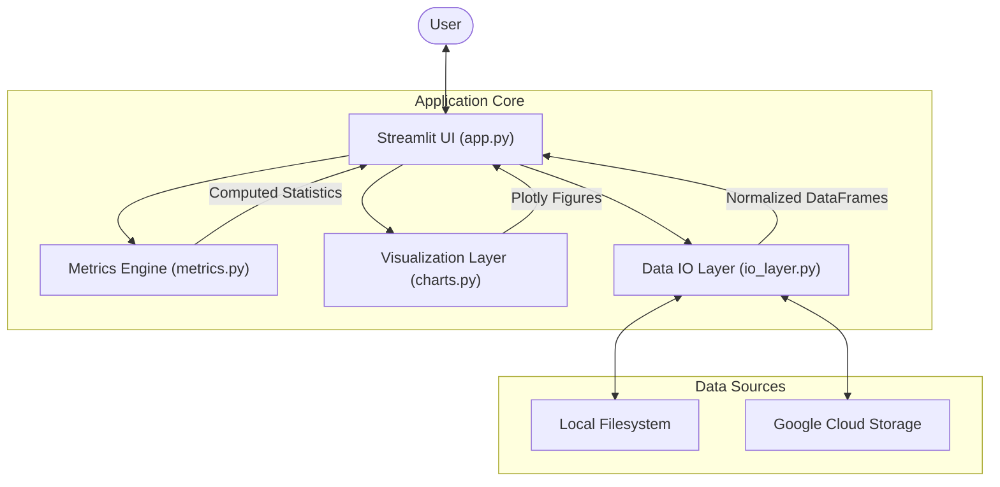

# 📊 Quantitative Strategy Performance Dashboard

[](https://www.python.org/)
[](https://streamlit.io/)
[](https://www.docker.com/)
[](https://cloud.google.com/)

A **production-grade quantitative analytics platform** designed to evaluate trading strategies using institutional metrics, Monte Carlo simulations, and interactive visualizations.

This project bridges the gap between **ad-hoc research scripts** and **scalable, cloud-native analytics systems**, with a strong emphasis on correctness, modularity, and deployment readiness.

---

## ✨ Key Features

- **📈 Institutional Performance Metrics**  
  Automatically computes Sharpe Ratio, Sortino Ratio, Calmar Ratio, CAGR, Maximum Drawdown, and Win/Loss ratios.

- **🎲 Monte Carlo Simulations**  
  Projects future performance distributions using randomized trade re-sampling to analyze risk and return uncertainty.

- **☁️ Cloud-Native & Scalable Design**
  - **Dual-Mode Data Access**: Seamlessly switches between local filesystem and **Google Cloud Storage (GCS)**.
  - **Containerized**: Fully Dockerized for consistent behavior across development and production environments.

- **🏎️ Interactive Visualizations**  
  High-performance Plotly charts including equity curves, drawdown (underwater) plots, and monthly performance heatmaps.

- **🛡️ Robust Architecture**  
  Clear separation of concerns (UI, Business Logic, Data Access, Visualization) ensures testability, maintainability, and long-term scalability.

---

## 🏗️ Architecture

The application follows a **modular layered architecture** designed to scale from a local analytics dashboard to a cloud-hosted platform.



### Core Components

#### `app.py` — Orchestration Layer
- Handles Streamlit UI rendering and state management.
- Coordinates data loading, computation, and visualization.
- Contains no financial or business logic.

#### `metrics.py` — Quantitative Logic Layer
- Pure Python / NumPy / Pandas implementation of financial metrics.
- Stateless and deterministic.
- Easily unit-testable and reusable in APIs or batch jobs.

#### `charts.py` — Visualization Layer
- Centralized Plotly graph construction.
- Decouples presentation from analytics logic.

#### `io_layer.py` — Data Access Layer
- Abstracts data ingestion and normalization.
- Supports both local .xlsx files and GCS blobs.
- Designed for easy extension to databases or data warehouses.

---

## 🛠️ Tech Stack

- **Frontend**: Streamlit
- **Analytics**: Pandas, NumPy
- **Visualization**: Plotly Graph Objects
- **Cloud Infrastructure**: Google Cloud Platform (Compute Engine/Cloud Run), Google Cloud Storage
- **DevOps**: Docker, Jenkins (CI/CD)

---

## 🚀 Getting Started

### Prerequisites
- Python 3.8+
- [Optional] Google Cloud SDK (for GCS features)

### Installation

1. **Clone the repository**
   ```bash
   git clone <repository-url>
   cd quant-strategy-analytics-gcp
   ```

2. **Install dependencies**
   ```bash
   pip install -r requirements.txt
   ```

3. **Run the application (Local Mode)**
   ```bash
   streamlit run app.py
   ```
   The dashboard will open at `http://localhost:8501`.

---

## ⚙️ Configuration & Data Modes

The application behavior is controlled via environment variables.

| Variable | Default | Description |
| :--- | :--- | :--- |
| `DATA_MODE` | `LOCAL` | `LOCAL` for local files, `GCS` for Google Cloud Storage. |
| `DATA_PATH` | `./data` | (Local Mode) Directory containing strategy `.xlsx` files. |
| `GCS_BUCKET` | *None* | (GCS Mode) Name of the GCS bucket. |
| `GCS_PREFIX` | `""` | (GCS Mode) Optional folder prefix within the bucket. |

### Data Contract
Input `.xlsx` files must contain trade logs with the following columns (normalized by `io_layer.py`):
*   `Exit Time` (Datetime)
*   `Symbol` (String)
*   `Entry Price` (Float)
*   `Exit Price` (Float)
*   `Size` (Integer)
*   `P/L` (Float)

---

## ⚠️ Failure Scenarios & Safeguards

| Scenario | Handling Strategy |
| :--- | :--- |
| Missing required columns | Explicit schema validation errors |
| Empty or incomplete datasets | Graceful UI warnings |
| NaN or corrupted values | Sanitized before metric computation |
| Large datasets | Architecture allows compute offloading or async processing |

---

## ☁️ Deployment

This project includes a complete **CI/CD pipeline** ready for Google Cloud Platform.

### Quick Deploy (Docker)
```bash
docker build -t quant-dashboard .
docker run -p 8501:8501 -v $(pwd)/data:/app/data quant-dashboard
```

### Full Cloud Deployment
Refer to the [Deployment Guide](deployment_guide.md) for a step-by-step tutorial on:
1. Setting up a GCP VM (Free Tier compatible).
2. Configuring Jenkins for automated builds.
3. Mounting GCS buckets using `gcsfuse`.

### Infrastructure as Code (Terraform)
For a fully automated deployment, usage the `terraform/` directory:

1. **Install Terraform**: [Download Here](https://developer.hashicorp.com/terraform/install).
2. **Initialize**:
   ```bash
   cd terraform
   terraform init
   ```
3. **Plan & Apply**:
   ```bash
   terraform apply -var="project_id=YOUR_PROJECT_ID" -var="bucket_name=YOUR_UNIQUE_BUCKET_NAME"
   ```
4. **Output**:
   Terraform will print the `instance_ip`.

### Manual Deployment (Docker Only)
If utilizing the simplified "Docker-Ready" infrastructure:

1.  **SSH into the VM**:
    ```bash
    gcloud compute ssh quant-dashboard-vm
    ```
2.  **Clone the Repo**:
    ```bash
    git clone https://github.com/shareitalike/quant-strategy-analytics-gcp.git
    cd quant-strategy-analytics-gcp
    ```
3.  **Build & Run**:
    ```bash
    # Build the image
    sudo docker build -t quant-app .

    # Run mapping: Host Port 8501 -> Container Port 8080 (where Streamlit runs)
    sudo docker run -d -p 8501:8080 \
      -v /home/ubuntu/quant-dashboard-files:/app/data \
      -e DATA_MODE=LOCAL \
      -e DATA_PATH=/app/data \
      quant-app
    ```
4.  **Access**: `http://<VM_IP>:8501`.

---

## 🤝 Contributing

1. Fork the repo.
2. Create a feature branch (`git checkout -b feature/amazing-feature`).
3. Commit your changes.
4. Open a Pull Request.

---

## 📄 License

Distributed under the MIT License. See `LICENSE` for more information.
